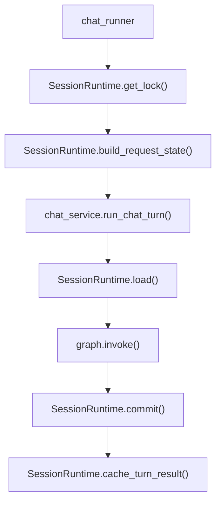

# Runtime 模块说明

`app/runtime/` 负责处理项目里的**会话运行时状态协调**，它不是业务 Agent，也不是 memory/retrieval 模块，而是站在更靠近“请求生命周期”和“session 连续性”的层次上工作。

如果说：

- `app/memory/` 负责“这一轮结束后记住什么”
- `app/retrieval/` 负责“问问题时怎么找资料”

那么 `app/runtime/` 负责的就是：

- **这一轮开始前，当前 session 应该从哪里恢复**
- **这一轮结束后，最终会话态应该写回哪里**

---

## 1. 目录职责总览

```text
app/runtime/
├── initial_state.py      # 初始 AgentState 工厂
├── snapshot.py           # 统一会话快照对象
├── session_backend.py    # 进程内 session backend（store / locks / guard）
├── session_cache.py      # session cache 门面
├── checkpoint_store.py   # LangGraph checkpoint 门面
└── session_runtime.py    # runtime 总门面
```

可以把这几层理解成：

- `initial_state.py`：回答“空会话长什么样”
- `snapshot.py`：回答“恢复出来的会话快照长什么样”
- `session_backend.py`：回答“进程内 session 真实存在哪里、怎么加锁”
- `session_cache.py`：回答“怎么安全读写进程内热状态”
- `checkpoint_store.py`：回答“怎么从 LangGraph checkpoint 读/写”
- `session_runtime.py`：回答“请求前后该怎么协调这些状态源”

---

## 2. initial_state：最小可运行状态

相关文件：

- [initial_state.py](/Users/manxin/baidu/ai-max/langgraph-agent/app/runtime/initial_state.py)

### 它负责什么

这里只做一件事：

- 生成最小可运行的 `AgentState`

当前默认字段很少：

- `session_id`
- `debug`
- `messages`
- `summary`

### 为什么单独拆出来

它最初是在 `chat_service.py` 里，但后来 runtime 和 API 层都需要它。

如果继续留在 `chat_service.py`，会造成：

- `session_store` 反向依赖 `chat_service`
- runtime 层引入循环导入风险

所以现在它单独存在，作为“空会话定义”。

---

## 3. snapshot：统一快照结构

相关文件：

- [snapshot.py](/Users/manxin/baidu/ai-max/langgraph-agent/app/runtime/snapshot.py)

### 它负责什么

`ConversationSnapshot` 表示：

- 一次 turn 开始前，runtime 能恢复出来的会话快照

重点字段：

- `session_id`
- `thread_id`
- `messages`
- `summary`
- `restored_from`
- `has_checkpoint_state`

### 为什么需要它

因为 runtime 可能从不同来源恢复状态：

- cache
- checkpoint
- empty

如果不引入统一快照对象，上层代码就会被迫理解这些底层分支。

引入 `ConversationSnapshot` 后：

- `chat_service` 只关心“恢复出来了什么”
- 不关心“它是从哪层存储来的”

---

## 4. session_backend：进程内 session 的真实实现

相关文件：

- [session_backend.py](/Users/manxin/baidu/ai-max/langgraph-agent/app/runtime/session_backend.py)

### 它负责什么

这里放的是当前单机部署下 session 热状态的真正底层实现：

- `session_store`
- `session_store_guard`
- `session_locks`

以及基础操作：

- `get_backend_session_lock(session_id)`
- `clear_in_memory_sessions()`

### 为什么要单独有 backend

因为我们不希望：

- runtime 层去依赖 API 兼容门面
- API 层再反过来成为底层实现持有者

现在的关系应该是：

- `runtime/session_backend.py`：底层实现
- `runtime/session_cache.py`：runtime 使用的门面
- `api/session_store.py`：兼容旧调用方的出口

### 当前限制

它只适合：

- 单进程
- 单机
- 进程内热缓存

不适合直接做多实例共享状态。

---

## 5. session_cache：cache 门面

相关文件：

- [session_cache.py](/Users/manxin/baidu/ai-max/langgraph-agent/app/runtime/session_cache.py)

### 它负责什么

提供对进程内热状态的统一操作：

- `get_session_state(session_id)`
- `set_session_state(session_id, state)`
- `clear_session_state(session_id)`
- `get_session_lock(session_id)`

### 这一层的意义

它的主要作用是把“全局 dict + guard + locks”这些细节藏起来。

这样：

- `SessionRuntime` 不需要直接碰 backend 里的共享变量
- 后面如果想替换 cache 实现，也能先从这里切

### 当前设计原则

- 读返回防御性拷贝
- 写再做一次拷贝
- 不把上层对象直接塞进共享 store

---

## 6. checkpoint_store：LangGraph checkpoint 门面

相关文件：

- [checkpoint_store.py](/Users/manxin/baidu/ai-max/langgraph-agent/app/runtime/checkpoint_store.py)

### 它负责什么

这里把 LangGraph checkpoint 的底层 API 收口成两个动作：

- `load_checkpoint_snapshot(graph, session_id)`
- `persist_final_checkpoint_state(graph, session_id, state, answer)`

### 为什么单独拆出来

因为如果把这些逻辑散落在 `chat_service.py`，就会出现两个问题：

1. service 层直接知道 `graph.get_state()` / `graph.update_state()` 的协议
2. checkpoint 恢复/提交流程不容易统一调整

现在它的定位是：

- **runtime continuity 的 checkpoint 适配层**

### 一个关键约束

当前最终 assistant message 仍然是在 `graph.invoke()` 返回后补写，
所以 `persist_final_checkpoint_state()` 不能只照抄图内 state，而要负责把最终消息补齐写回 checkpoint。

---

## 7. session_runtime：总门面

相关文件：

- [session_runtime.py](/Users/manxin/baidu/ai-max/langgraph-agent/app/runtime/session_runtime.py)

### 它负责什么

这是 runtime 目录里最重要的文件。

它统一负责：

- 获取 session 锁
- 构造请求态
- cache / checkpoint 恢复决策
- checkpoint 提交
- cache 写回

当前主要接口：

- `get_lock(session_id)`
- `build_request_state(...)`
- `load(session_id, graph)`
- `commit(session_id, graph, state, answer)`
- `cache_turn_result(session_id, result)`
- `clear(session_id)`

### 为什么它是核心门面

因为当前系统有多套状态源：

- session cache
- checkpoint
- history
- vector memory

其中 runtime 这一层主要协调前两者：

- **session cache**：热状态
- **checkpoint**：冷恢复

这样业务代码就不需要自己处理：

- 什么时候该从 checkpoint 恢复
- 什么时候只读 cache
- 什么时候要把最终 answer 写回 checkpoint

---

## 8. 当前状态流和 runtime 的位置

runtime 在一次 `/chat` 请求里的位置，大致如下：



也就是说：

- API 层通过 runtime 读/写进程内状态
- `chat_service` 通过 runtime 决定是否走 checkpoint 恢复
- runtime 统一协调“热状态”和“冷恢复”

---

## 9. 常见改动应该去哪里

### 场景 1：想改空会话默认字段

优先看：

- [initial_state.py](/Users/manxin/baidu/ai-max/langgraph-agent/app/runtime/initial_state.py)

### 场景 2：想改 checkpoint 恢复/提交逻辑

优先看：

- [checkpoint_store.py](/Users/manxin/baidu/ai-max/langgraph-agent/app/runtime/checkpoint_store.py)
- [session_runtime.py](/Users/manxin/baidu/ai-max/langgraph-agent/app/runtime/session_runtime.py)

### 场景 3：想改 session cache 的读写或锁逻辑

优先看：

- [session_backend.py](/Users/manxin/baidu/ai-max/langgraph-agent/app/runtime/session_backend.py)
- [session_cache.py](/Users/manxin/baidu/ai-max/langgraph-agent/app/runtime/session_cache.py)

### 场景 4：想继续收敛 API 层对状态流的感知

优先看：

- [session_runtime.py](/Users/manxin/baidu/ai-max/langgraph-agent/app/runtime/session_runtime.py)
- [app/api/chat_runner.py](/Users/manxin/baidu/ai-max/langgraph-agent/app/api/chat_runner.py)

---

## 10. 与全局文档的关系

如果你想看的是：

- **整个系统的状态模型**
- checkpoint / history / vector memory 的全局分工
- 单实例限制与后续演进方向

请优先看：

- [docs/runtime-state.md](/Users/manxin/baidu/ai-max/langgraph-agent/docs/runtime-state.md)

如果你想看的是：

- `app/runtime/` 目录里每个文件具体做什么
- 代码应该改哪一层

请优先看当前这份文档。
