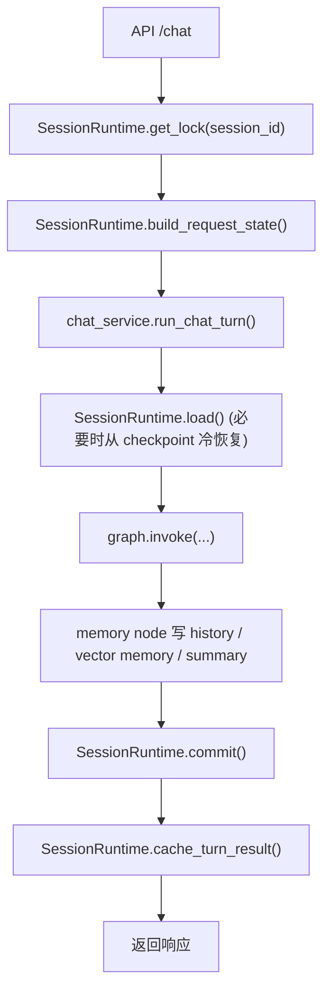

# Runtime State 设计说明

本文档说明项目当前的会话状态模型，重点回答 4 个问题：

1. 一次 `/chat` 请求会经过哪些状态层
2. `session cache / checkpoint / conversation history / vector memory` 各自负责什么
3. 当前锁模型如何避免同 session 并发污染
4. 后续如果继续演进，应该沿哪个方向收敛

---

## 1. 设计目标

当前项目不是“单一状态源”架构，而是把不同职责拆给不同存储层：

- **进程内 session cache**：同进程热状态复用
- **LangGraph checkpoint**：graph state 恢复
- **conversation history**：顺序历史回放
- **vector memory**：跨轮语义召回

这种设计的目标不是绝对简洁，而是把“恢复”“回放”“召回”这三件事拆开处理。

---

## 2. 当前状态源职责

### 2.1 session cache

相关文件：

- [app/runtime/session_backend.py](/Users/manxin/baidu/ai-max/langgraph-agent/app/runtime/session_backend.py)
- [app/runtime/session_cache.py](/Users/manxin/baidu/ai-max/langgraph-agent/app/runtime/session_cache.py)

职责：

- 保存当前进程内的热会话状态
- 避免同一进程内每次都从 checkpoint 恢复
- 为多轮请求提供低延迟复用

特点：

- 单机单进程内有效
- 不是跨进程共享状态
- 不是长期真相源

当前只持久以下字段：

- `session_id`
- `messages`
- `summary`

### 2.2 LangGraph checkpoint

相关文件：

- [app/checkpointing/factory.py](/Users/manxin/baidu/ai-max/langgraph-agent/app/checkpointing/factory.py)
- [app/runtime/checkpoint_store.py](/Users/manxin/baidu/ai-max/langgraph-agent/app/runtime/checkpoint_store.py)

职责：

- 持久化 graph state
- 服务重启后恢复同一个 `thread_id/session_id` 的执行上下文
- 为同一会话提供“冷恢复”能力

特点：

- 主要服务于 runtime continuity
- 不用于“历史问题列表”这种顺序回放查询

### 2.3 conversation history

相关文件：

- [app/memory/history](/Users/manxin/baidu/ai-max/langgraph-agent/app/memory/history)

职责：

- 保存按时间顺序排列的历史问题事件
- 服务“总结所有问题”“历史问题包括什么”这类查询
- 提供 ordered replay，而不是 graph state 恢复

特点：

- 当前默认 SQLite
- 不承担完整 session state 恢复职责

### 2.4 vector memory

相关文件：

- [app/memory/vector_memory.py](/Users/manxin/baidu/ai-max/langgraph-agent/app/memory/vector_memory.py)

职责：

- 保存适合语义召回的会话记忆
- 服务 follow-up、事实延续、相关主题 recall

特点：

- 不是完整历史
- 不是有序事件流
- 只是 semantic recall layer

---

## 3. Runtime 层分工

当前状态收口后，runtime 层由 4 个模块组成：

- [app/runtime/snapshot.py](/Users/manxin/baidu/ai-max/langgraph-agent/app/runtime/snapshot.py)
- [app/runtime/session_cache.py](/Users/manxin/baidu/ai-max/langgraph-agent/app/runtime/session_cache.py)
- [app/runtime/checkpoint_store.py](/Users/manxin/baidu/ai-max/langgraph-agent/app/runtime/checkpoint_store.py)
- [app/runtime/session_runtime.py](/Users/manxin/baidu/ai-max/langgraph-agent/app/runtime/session_runtime.py)

### 3.1 ConversationSnapshot

`ConversationSnapshot` 表示：

- 当前 session 在一次 turn 开始前，能恢复出来的会话快照
- 它不关心底层来自 cache 还是 checkpoint

字段重点：

- `messages`
- `summary`
- `restored_from`
- `has_checkpoint_state`

### 3.2 SessionRuntime

`SessionRuntime` 是当前会话状态的统一门面。

它负责：

- `get_lock(session_id)`：获取同 session 互斥锁
- `build_request_state(...)`：基于 session cache 构造请求态
- `load(session_id, graph)`：在真正执行 graph 前决定是否走 checkpoint 恢复
- `commit(session_id, graph, state, answer)`：提交最终 checkpoint + cache
- `cache_turn_result(session_id, result)`：把结果裁成跨 turn 状态写回 cache

设计原则：

- API 层不直接操作 `session_store`
- `chat_service` 不直接操作 `graph.get_state()` / `graph.update_state()`
- 状态恢复与状态提交由 runtime 统一协调

---

## 4. 一次请求的完整状态流

当前一次 `/chat` 请求的大致流程如下：



更细一点：

1. `chat_runner` 获取同 session 锁
2. `SessionRuntime.build_request_state()` 从内存 cache 构造本轮请求态
3. `run_chat_turn()` 发现当前 state 没有上下文时，调用 `SessionRuntime.load()`
4. `SessionRuntime.load()`：
   - cache 有有效消息/摘要：直接命中
   - cache 只是空初始态：继续回退到 checkpoint
   - checkpoint 也没有：空会话开始
5. `graph.invoke()` 执行完整图
6. `memory node` 负责：
   - 刷新 summary
   - 写 vector memory
   - 写 conversation history
7. `SessionRuntime.commit()`：
   - 把最终 assistant 消息补写回 checkpoint
   - 把精简后的会话态写回 session cache
8. `chat_runner` 返回 API 响应

---

## 5. 为什么 cache miss 不能只看“有没有 dict”

这是当前 runtime 里最容易踩坑的地方。

原因：

- API 层在首次访问某个 session 时，会先创建一个最小初始态
- 这个初始态本身就是一个 dict

如果 `SessionRuntime.load()` 只判断“cache 中是否存在 dict”，那就会出现错误：

- 明明应该从 checkpoint 冷恢复
- 却因为 cache 里已经有一个空 dict，被误判为命中

所以当前规则是：

- **只有当 cache 里真的有 `messages` 或 `summary` 时，才算有效 cache 命中**
- 否则继续回退到 checkpoint

这条规则已经由测试覆盖：

- [tests/test_session_runtime.py](/Users/manxin/baidu/ai-max/langgraph-agent/tests/test_session_runtime.py)

---

## 6. 为什么 commit 时要无条件补 assistant message

当前项目的最终 assistant message 仍然是在 `graph.invoke()` 返回后补写。

这意味着：

- 如果只依赖图内部状态，不一定包含最终 assistant reply
- 所以 `SessionRuntime.commit()` 需要把最终态再写回 checkpoint

注意：

- 即使 `answer == ""`
- 当前也仍然会补一条 assistant message

原因是为了保持 `messages` 的 user/assistant 轮次闭环，避免多轮上下文结构变化。

这同样已由 E2E 测试覆盖：

- [tests/test_e2e_graph.py](/Users/manxin/baidu/ai-max/langgraph-agent/tests/test_e2e_graph.py)

---

## 7. 当前并发模型

当前项目的并发模型是：

- **同 session 串行**
- **不同 session 并行**

锁实现位于：

- [app/runtime/session_backend.py](/Users/manxin/baidu/ai-max/langgraph-agent/app/runtime/session_backend.py)

锁顺序约定：

1. 先在短时间内拿 `session_store_guard` 查/建 `session_lock`
2. 再持有 `session_lock` 跑整轮请求
3. 需要写 cache 时，再短暂拿 `session_store_guard`

也就是：

```text
store_guard(短) -> session_lock(长) -> store_guard(短)
```

禁止的模式：

```text
session_lock(长) -> store_guard(长)
```

那样容易造成死锁或锁等待扩散。

---

## 8. 当前限制

这套模型当前适合：

- 单容器
- 单进程
- 单机部署

不适合直接外推到：

- 多 worker
- 多实例
- 多副本水平扩展

原因：

- session cache 是进程内内存结构
- session lock 也是进程内锁

如果后续需要多实例扩展，建议方向是：

- 进一步弱化 `session cache`
- 让 continuity 更依赖 checkpoint + history
- 必要时再引入外部协调存储（如 Redis）

---

## 9. 当前推荐的“真相源”理解

建议把当前系统理解成：

- **会话连续性真相源**：checkpoint
- **有序历史真相源**：conversation history
- **语义召回真相源**：vector memory
- **性能优化缓存**：session cache

也就是说：

- session cache 是“加速器”
- 不是最终权威状态

---

## 10. 后续推荐演进方向

### 10.1 短期

- 保持 `SessionRuntime` 继续作为统一门面
- 不再让新业务代码直接依赖 `app.api.session_store`
- 继续把状态相关逻辑收口到 runtime 层

### 10.2 中期

- 为 runtime 层补更多专项测试
- 增加状态恢复/提交的 tracing metadata
- 继续拆薄 [app/nodes/memory.py](/Users/manxin/baidu/ai-max/langgraph-agent/app/nodes/memory.py)

### 10.3 长期

- 如果走多实例部署，重新设计 session consistency 策略
- 视规模决定是否引入外部 session coordination store

---

## 11. 相关阅读

- [README.md](/Users/manxin/baidu/ai-max/langgraph-agent/README.md)
- [app/chat_service.py](/Users/manxin/baidu/ai-max/langgraph-agent/app/chat_service.py)
- [app/api/chat_runner.py](/Users/manxin/baidu/ai-max/langgraph-agent/app/api/chat_runner.py)
- [app/runtime/session_runtime.py](/Users/manxin/baidu/ai-max/langgraph-agent/app/runtime/session_runtime.py)
- [app/checkpointing/factory.py](/Users/manxin/baidu/ai-max/langgraph-agent/app/checkpointing/factory.py)
