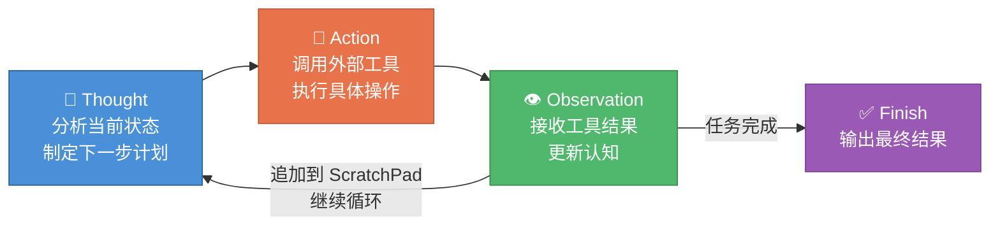
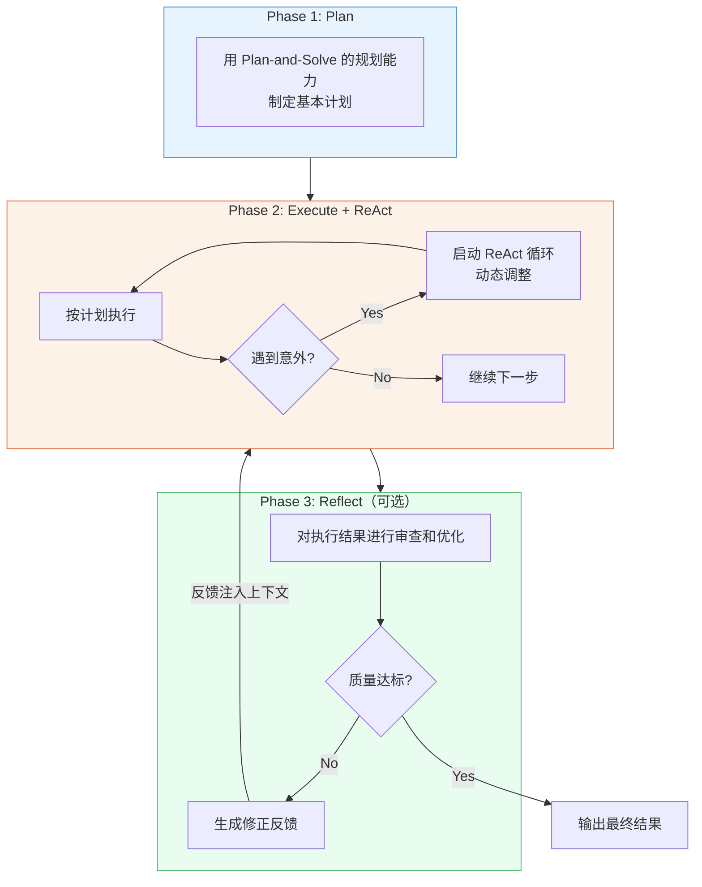
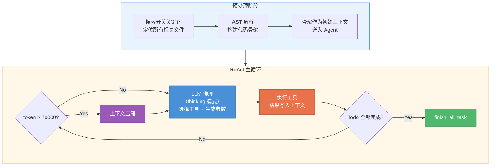
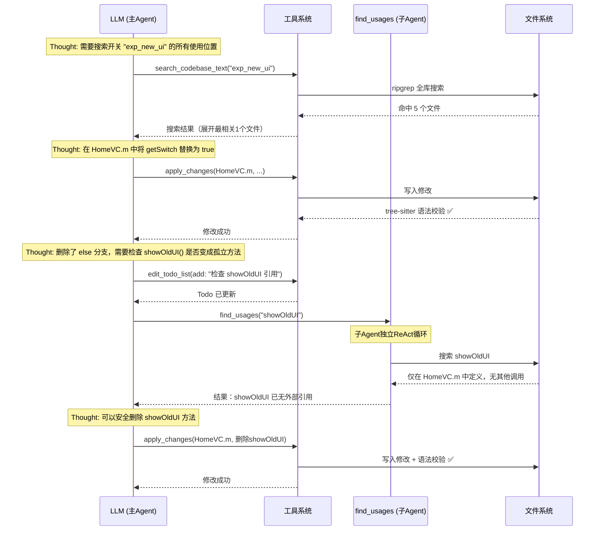
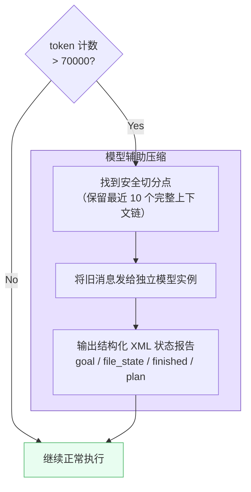
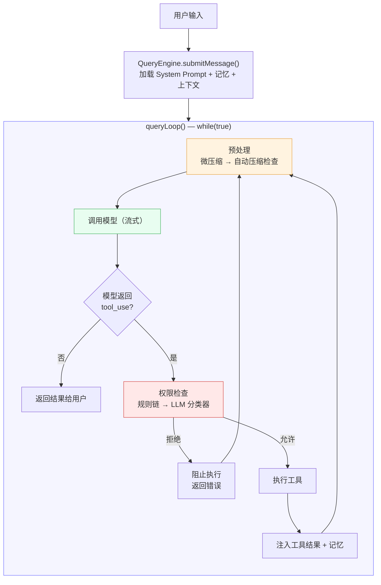
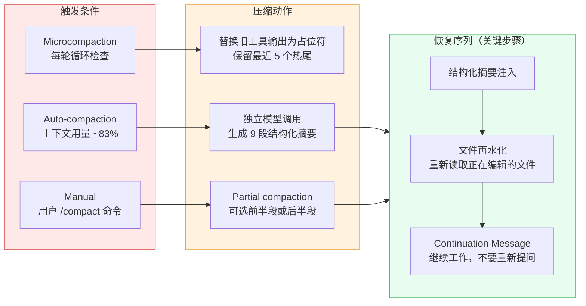
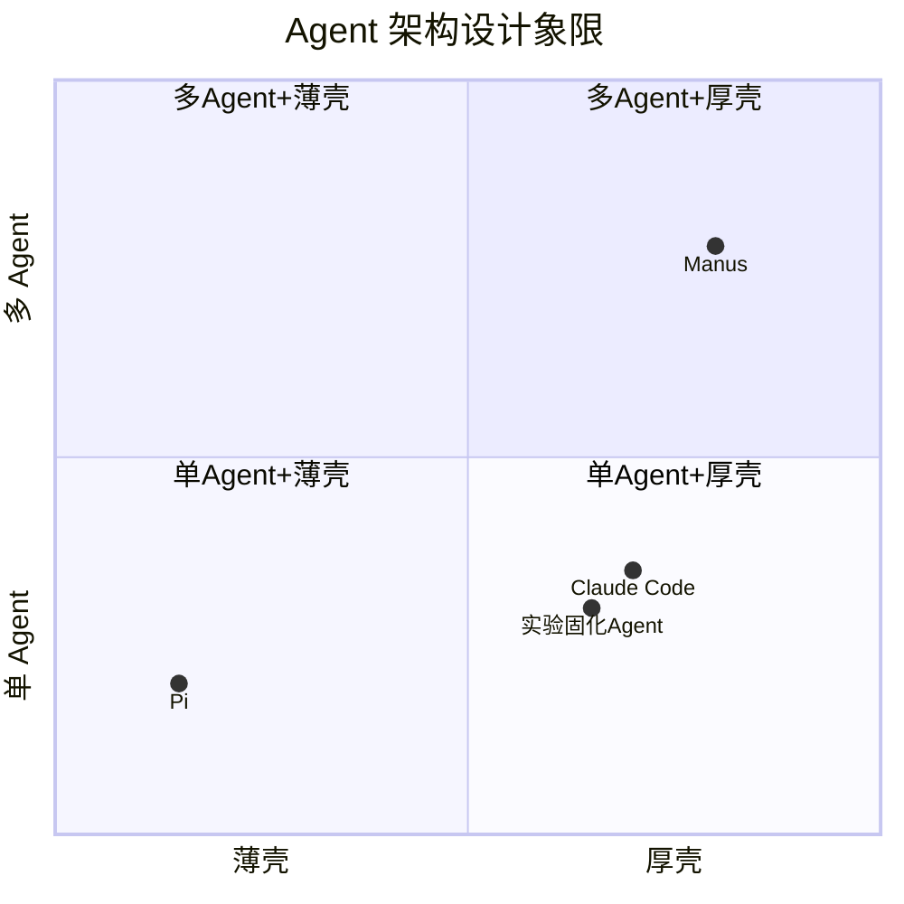

Agent 怎么设计：从实验固化说起

## 一、什么是 Agent

### 1.1 从 LLM 到 Agent：为什么需要循环

传统的 LLM 使用方式是"一问一答"：用户输入 prompt，模型返回结果，交互结束。这种**单次调用**模式有两个根本性限制（[ReAct, Yao et al. 2022](https://arxiv.org/abs/2210.03629)）：

- **无法与外部世界交互**：模型只在内部做逻辑推演（Chain-of-Thought），它可以推导出"需要查天气"，但没办法真的去查。遇到需要实时信息、需要操作文件、需要执行代码的问题，纯推理无能为力。
- **无法自我纠错**：单次调用没有反馈循环——模型不知道自己的输出是否正确，出错了也没有机会修正。

Agent 的核心突破在于：**LLM 不再是单次调用，而是循环驱动的决策引擎**——推理指导行动，行动的结果又修正推理。

### 1.2 ReAct：边想边做

ReAct（Reasoning + Acting）是最经典的 Agent 范式（[Yao et al. 2022](https://arxiv.org/abs/2210.03629)），将推理和行动绑定为闭环。每一步输出遵循固定轨迹：

- **Thought（思考）**：智能体的"内心独白"——分析当前情况、制定下一步计划、反思上一步结果
- **Action（行动）**：调用外部工具，如 `Search["华为最新款手机"]`、`weather_api(city="北京")`
- **Observation（观察）**：工具返回的结果，作为下一轮思考的输入



```
while not done:
    thought     = LLM.think(history)          # 思考：分析当前状态
    action      = LLM.decide(thought)         # 决策：选择下一步行动
    observation = Environment.execute(action)  # 执行：调用工具，获得反馈
    history.append(thought, action, observation)  # 追加到上下文（ScratchPad）
```

用一个具体的例子来感受这个循环——"苹果公司现任 CEO 的母校是哪所大学？"：

```
Thought 1: 我需要先查苹果公司现任 CEO 是谁。
Action 1:  Search["苹果公司 现任CEO"]
Observation 1: 蒂姆·库克 (Tim Cook) 自2011年起担任苹果公司CEO。

Thought 2: 现任CEO是蒂姆·库克，接下来查他的母校。
Action 2:  Search["蒂姆·库克 教育背景 母校"]
Observation 2: 库克本科毕业于奥本大学，后获得杜克大学MBA。

Thought 3: 已经找到答案了。
Action 3:  Finish["蒂姆·库克本科毕业于奥本大学，MBA毕业于杜克大学。"]
```

关键特征：**边想边做**——每一步的观察结果决定下一步的行动，没有预设的固定流程。模型的所有历史 Thought/Action/Observation 都保留在一个"草稿本"（ScratchPad）中，作为后续决策的上下文。

**ReAct 的局限性**：

- **上下文膨胀**：每一轮循环都往 ScratchPad 追加内容，长任务容易超出 token 限制
- **容易发散**：缺乏全局规划，可能走弯路或重复操作
- **效率问题**：每步都需要一次 LLM 推理 + 一次工具调用，简单任务也要多轮

### 1.3 Plan-and-Solve：想好再做

Plan-and-Solve（[Wang et al. 2023](https://arxiv.org/abs/2305.04091)）的核心区别在于：**先规划完整计划，再逐步执行**。

如果说 ReAct 像一个经验丰富的**侦探**，根据现场蛛丝马迹一步步推理，随时调整调查方向；那么 Plan-and-Solve 更像一位**建筑师**，动工之前必须先绘制完整蓝图，然后按蓝图施工。

```
# 阶段一：规划
plan = LLM.make_plan(task)

# 阶段二：执行
for step in plan:
    result = Environment.execute(step)
    if need_replan(result):
        plan = LLM.replan(plan, result)  # 可选：动态重规划
```

同一个 CEO 母校的例子，Plan-and-Solve 的执行方式：

```
[Plan]
  Step 1: 搜索苹果公司现任 CEO 是谁
  Step 2: 根据 Step 1 的结果，搜索该人的教育背景
  Step 3: 整合信息，输出最终答案

[执行 Step 1] Search["苹果公司 现任CEO"] → 蒂姆·库克
[执行 Step 2] Search["蒂姆·库克 教育背景"] → 奥本大学（本科）、杜克大学（MBA）
[执行 Step 3] Finish["蒂姆·库克本科毕业于奥本大学，MBA毕业于杜克大学。"]
```

**Plan-and-Solve 的局限性**：

- **计划僵化**：初始计划可能不适应实际情况。比如规划了"搜索户外景点"，但执行中发现在下雨——原计划已经不适用
- **难以处理意外**：执行过程中遇到的新信息无法自然融入已有计划
- **规划本身有成本**：对于简单任务，先规划再执行反而比 ReAct 多了一次 LLM 调用

### 1.4 Reflection：做完再反思

Reflection 是第三种重要范式（[Shinn et al. 2023](https://arxiv.org/abs/2303.11366)），核心思想是：**执行后加入自我反思和修正的循环**。

```
for attempt in range(max_tries):
    result = Agent.execute(task)           # 第一步：执行（用 ReAct 或 Plan-and-Solve）
    feedback = LLM.reflect(result)         # 第二步：反思——找出错误和不足
    if feedback.is_good_enough():
        break
    task = task + feedback                 # 第三步：将反馈注入上下文，重新执行
```

Reflection 适用于**对结果质量有高要求**的场景。比如代码生成：先生成一版代码，然后让 LLM（或独立的"评审员"模型）审查代码中的 bug 和风格问题，再根据反馈修正。

**Reflection 的局限性**：

- **成本翻倍**：每次反思都是额外的 LLM 调用
- **可能过度反思**：反复修正可能导致"改来改去"，不收敛
- **需要好的评估能力**：反思的质量取决于模型能否准确识别问题

### 1.5 三种范式的对比与融合

|              | ReAct                    | Plan-and-Solve         | Reflection               |
| ------------ | ------------------------ | ---------------------- | ------------------------ |
| **一句话**   | 边想边做，动态应变       | 想好再做，按图施工     | 做完反思，迭代改进       |
| **比喻**     | 侦探办案                 | 建筑师施工             | 编辑审稿                 |
| **决策时机** | 每一步                   | 开始时一次             | 执行后复盘               |
| **灵活性**   | 高                       | 较低                   | 中等                     |
| **全局规划** | 弱                       | 强                     | 不涉及                   |
| **适合场景** | 需要外部工具的开放性任务 | 流程明确、可预期的任务 | 对结果质量要求极高的任务 |
| **典型问题** | 发散、循环、效率低       | 计划僵化、难应对意外   | 成本高、可能不收敛       |

**现实中多数系统是混合形态**：



我们在实验固化 Agent 中采用的方案就是一种混合：**ReAct 循环 + 动态 Todo List（软性规划）+ 语法校验门控（轻量反思）**——既保持了执行的灵活性，又通过 Todo 派生法则维护了任务完整性的约束，还通过 tree-sitter 语法检查提供了一层确定性的"反思"。

---

## 二、实验固化 Agent 的设计

### 2.1 问题定义

大家都熟悉实验固化——把开关取值固定后，做一系列代码清理。具体来说，固化不只是把 `getSwitch("key")` 替换成 `true`，它是一个**级联式代码重构任务**：

1. **常量传播**：将 `getSwitch("key")` 替换为固定值
2. **分支简化**：消除永远不会走到的 if/else 分支
3. **死代码消除**：删除只在死分支中调用的方法、变量
4. **级联清理**：删除的方法可能导致其他方法变为孤立代码，需要递归清理
5. **引用清理**：清理不再使用的 import、变量定义等

**说实话，这个任务对人来说不难**。有 IDE 的 Find Usages、全局替换、编译检查，一个熟练的开发者处理一个开关大概十几分钟到半小时。不存在"人做不了"的问题。

**真正的痛点是重复**：

- 每个实验最终都要走向结论——要么推全固化，要么代码下线——都需要做开关清理
- 这是纯体力活——搜索、替换、删分支、清死代码、编译验证，机械重复
- 占用开发者时间但不产生任何业务价值

**所以做这个 Agent 的目的不是解决"难题"，而是验证一个问题：这类简单但重复的代码重构任务，AI 能否全自动交付？** 具体来说：

- 不需要人 review 每一步操作
- 输出的代码能直接通过编译
- 准确率足够高，可以批量运行

这是一个很好的 Agent 试验场——任务足够结构化可以评估质量，又有足够的细节变化不能用纯规则引擎硬编码。

### 2.2 Agent Loop

我们采用的是 **ReAct 模式 + 动态 Todo List 驱动**，而不是 Plan-and-Solve。

**整体流程**：



**为什么选 ReAct 而不是 Plan-and-Solve？**

实验固化表面上流程明确（搜索 → 替换 → 清理），但实际执行中有大量**不可预见的级联影响**。一个开关可能牵连出十几个需要清理的文件和方法，这些在执行前是无法完全预知的。ReAct 的"边走边看"更适合这种不断发现新任务的场景。

但纯 ReAct 容易发散，所以我们引入了 **Todo List 作为软性规划**：

- 模型在执行过程中通过 `edit_todo_list` 工具维护任务列表
- System Prompt 中定义了**派生法则**，引导模型在每次修改后自动生成后续检查任务：

```
派生法则：
- 删除方法调用 → 添加任务：检查该方法是否变成孤立方法
- 删除变量引用 → 添加任务：检查变量定义是否可删除
- 简化分支     → 添加任务：检查分支中的私有方法/属性
- 固定返回常量 → 添加任务：待引用处理完后删除该方法
- 删除定义     → 添加任务：检查 import 是否需要清理
```

这让 Agent 既保持了 ReAct 的灵活性，又通过 Todo List 维持了任务完整性的约束。

**终止条件**：调用 `finish_all_task` 时会校验 Todo List 中所有任务是否都已标记为 `completed`，确保不会遗漏。

### 2.3 工具设计

Agent 可以调用 7 个工具，覆盖搜索、查看、修改、删除、引用查找和任务管理：

#### 工具清单

| 工具                   | 职责         | 关键设计                                                                               |
| ---------------------- | ------------ | -------------------------------------------------------------------------------------- |
| `search_codebase_text` | 全库文本搜索 | 底层用 ripgrep，支持字面量和正则；按命中次数排序；只展开最相关的 1 个文件预览          |
| `inspect_file`         | 查看文件内容 | 小文件（<100 行）返回全文；大文件用 tree-sitter 做 AST 解析，返回"代码骨架"            |
| `apply_changes`        | 修改代码     | 原子性修改（全成功或全回滚）；修改后 tree-sitter 语法校验门控；强制要求 reasoning 参数 |
| `delete_files`         | 删除文件     | 批量删除，每个文件需提供 reasoning                                                     |
| `find_usages`          | 查找符号引用 | **嵌套子 Agent**——内部有独立的 ReAct 循环和工具集                                      |
| `edit_todo_list`       | 管理任务列表 | 4 种状态（pending/in_progress/paused/completed）；强制同时只有 1 个 in_progress        |
| `finish_all_task`      | 终止 Agent   | 校验所有 todo 是否完成                                                                 |

#### `search_codebase_text`：全库搜索

底层调用 ripgrep，以 JSON 模式输出，逐行解析 `begin`/`match`/`context`/`end` 事件流，构建每个文件的匹配预览块。

- **字面量 vs 正则**：默认 `--fixed-strings` 字面量匹配；`is_regex=True` 时切换为 `--pcre2`
- **文件类型过滤**：只搜索 `.java`、`.kt`、`.h`、`.m`、`.swift`，通过 glob 参数限定
- **结果排序**：按每个文件的匹配次数降序排列
- **输出裁剪**：只有排名第 1 的文件展示完整代码预览（带 5 行上下文），其余最多列出 10 个文件路径和命中数，再多的只显示"还有 N 个文件未显示"

#### `inspect_file`：查看文件

根据文件大小走两条路径：

- **小文件（<100 行）**：直接返回全文
- **大文件（≥100 行）**：用 tree-sitter 解析 AST，通过 BFS 搜索与关键词匹配的方法/属性节点（`slice_code` 中用 word-boundary 正则匹配），拼装出"代码骨架"——只包含 import（过滤无关项）、类定义头、和匹配到的代码节点，节点之间用 `// ... (上下文已省略) ...` 分隔并标注行号范围
- **降级处理**：AST 解析失败时（`root_node.has_error`），退化为简单的文本关键词搜索，返回匹配行附近的上下文

不过实际使用中发现 LLM 不太认骨架，倾向于自己读全文，后续可能会简化为直接读文件。

#### `apply_changes`：修改代码

修改方式是**基于文本匹配替换**（提供 `old_content` → `new_content`），而不是基于行号。早期用过行号方案，但有两个问题：一是 LLM 对数字操作容易出错，算错行号导致改错位置；二是每次修改后行号会变，必须强制重新读一遍文件刷新行号，多了一轮工具调用。文本匹配虽然要求 `old_content` 唯一，但更符合 LLM 的能力特点。

在此基础上有三层防护：

**1. 原子性**：所有修改先在内存副本上执行。对每处修改，检查 `old_content` 在文件中是否**恰好出现 1 次**——0 次报找不到，>1 次报歧义。任何一处修改失败，则**全部不写入**。

**2. 语法校验门控**：全部替换成功后，用 tree-sitter 解析修改后的代码。如果引入了新的语法错误（`root_node.has_error`），**拒绝写入并回滚**，返回友好的错误诊断（如"缺失了符号 `}`，可能未闭合代码块"）。有一个细节：如果原文件本身就有语法错误，则放行——不阻止修复已有问题的修改。

**3. 强制 reasoning**：`reasoning` 是必填参数，要求模型在修改前说明理由。这个参数不参与实际替换逻辑，但会被记录到修改历史中（时间戳、文件路径、成功/失败、修改快照），同时起到强制 Chain-of-Thought 的作用。

#### `find_usages`：子 Agent 查找引用

引入这个工具的原因很具体：哪怕是 deepseek-v3.2 开启思考模式，遇到复杂的固化任务（需要修改很多处代码）时，如果出现了名字比较通用的方法（比如 `isHitExp`、`getName`），全库搜索会返回大量同名匹配结果。主 Agent 在处理这些结果时很容易跳步，遗漏部分代码的修改。专门引入 `find_usages` 子 Agent，就是让它**专注于处理引用查找这一个问题**，不受主任务上下文的干扰。

- **独立的 LLM 实例**：用 deepseek-v3.2，有自己的 System Prompt（定位为"高级静态代码分析专家"）
- **独立的工具集**（5 个工具）：`find_files`（ripgrep 多模式搜索）、`explore_file`（文件读取和搜索）、`edit_todo_list`、`submit_task_result`（结构化输出，最多 10 个文件的行级代码预览）、`reject_task`
- **独立的 ReAct 循环**：自主决定搜索策略，多轮搜索和验证，直到调用 `submit_task_result` 或 `reject_task` 终止
- **独立的上下文管理**：有自己的压缩阈值，超限时独立压缩

代价是增加了 token 消耗和延迟，但换来了更高的准确率。

#### 工具的输入输出约定

所有工具继承自 `BaseTool` 抽象基类，统一定义：

```python
class BaseTool(ABC):
    def get_tool_manual(self) -> Dict[str, Any]   # OpenAI function calling schema
    async def work(self, arguments: Dict) -> str   # 执行，返回纯文本结果
    def get_name(self) -> str
```

输出统一为**纯文本字符串**返回给模型，各工具内部控制输出长度，避免一次性返回过多内容撑爆上下文。输入侧做**参数校验**——LLM 生成的工具参数不一定合法（缺字段、类型错误、路径不存在等），校验不通过直接返回错误信息让模型重试，不进入实际执行。和语法校验门控一样，这也是**用确定性的工程手段兜底模型的不确定性**。

安全设计：所有涉及文件路径的工具都通过 `os.path.commonpath` 做路径遍历防护，防止模型构造恶意路径访问代码库之外的文件。

#### 一次典型的工具调用序列

下面是一个具体开关固化任务中，Agent 的实际工具调用序列示意：



### 2.4 上下文管理

上下文管理是长任务 Agent 的核心挑战。一个复杂开关的固化可能需要 100+ 轮工具调用，上下文会快速膨胀。

当 token 超过 70000 阈值时，触发**模型辅助压缩**：

- 找到安全切分点（保留最近 10 个工具调用的完整上下文链）
- 将旧消息发送给**独立的模型实例**进行压缩
- 输出结构化的 XML 格式"项目状态报告"：

```xml
<overall_goal>原始任务目标</overall_goal>
<file_system_state>已修改文件列表</file_system_state>
<finished_task>已完成任务</finished_task>
<current_plan>当前进行中的任务</current_plan>
```

关键设计：**用独立模型实例做压缩**——压缩操作本身也消耗 token，如果用主循环的模型会进一步加重上下文压力。

#### 压缩流程



### 2.5 模型选择：模型能力是 Agent 性能的天花板

当前使用 deepseek-v3.2 并开启 thinking 模式。但这不是一开始的选择——模型经历了几轮迭代，过程中最大的体会是：**同一套 Agent 代码，换一个更强的模型，效果提升比优化任何工程细节都大**。

#### 早期模型的问题

最早用的是 deepseek-v3.1 和 qwen3-coder-480b-a35b-instruct，两个都不行，主要表现在：

**条件表达式算错**：遇到复杂的嵌套条件（比如 `if (a && (b || !c))`），模型会算错分支走向，导致不该删的代码被删了。为此在 System Prompt 里加了"列出条件表达式的计算过程"的要求，相当于强制 Chain-of-Thought，有一定改善但治标不治本。

**指令遵循差，表现随机**：复杂任务时模型会遗忘步骤——该检查的引用没检查，该清理的 import 没清理。最直观的表现是：**同一个开关跑几次，改出来的代码很不一样**，结果非常不稳定。

**死循环问题**：`temperature=0` 时，如果工具连续几次调用出错，模型会陷入完全相同的重试死循环——每次生成一模一样的错误调用，永远无法跳出。

#### 升级到 deepseek-v3.2 + thinking 模式后

换模型 + 开启 thinking 模式后，同一套 Agent 代码的效果有很明显的提升：

- **稳定性**：同一个开关跑几次，结果基本一致——这是最直观的改善
- **条件推理准确**：复杂条件表达式的处理准确性很高，基本没遇到过出错的情况
- **不再死循环**：thinking 模式下模型遇到工具报错会主动换思路，而不是机械重试

#### 启示

这段经历说明一个事实：**Agent 的工程设计再精巧，也难以弥补模型能力的不足**。很多看似需要工程手段解决的问题（指令遵循差 → 加更复杂的 prompt；死循环 → 加重试上限和检测逻辑），其实只需要一个更强的模型就自然消失了。这也呼应了第四章会讲到的趋势——壳在变薄，因为模型在变强。

---

## 三、他山之石：Manus、Claude Code 与 Pi

### 3.1 Manus

Manus 是 2025 年 3 月爆火的通用 AI Agent 产品。Manus 是闭源的，没有公开过完整架构，以下基于其官方博客和公开信息整理。

**已知的关键设计**（来源：[官方博客](https://manus.im/blog/Context-Engineering-for-AI-Agents-Lessons-from-Building-Manus)）：

- **基于前沿模型的 in-context learning，而非自训练端到端模型**：Manus 选择在闭源前沿模型之上做上下文工程，而不是基于开源模型做端到端强化学习训练
- **上下文工程是核心竞争力**：官方博客的主题就是上下文工程，团队经历了四次框架重构。核心挑战是 Agent 场景下上下文快速膨胀（平均输入输出 token 比约 100:1）
- **KV Cache 命中率是关键指标**：直接影响延迟和成本，Manus 围绕 cache 友好做了大量优化（如 append-only 的上下文结构，避免修改已有消息）
- **文件系统作为扩展上下文**：将文件系统视为"终极上下文"——大小无限、天然持久、Agent 可直接操作。压缩策略设计为可恢复的（如保留 URL 就可以丢弃网页内容）
- **沙箱执行**：任务在云端虚拟机中运行，支持异步长时间执行
- **多 Agent 协作**：采用规划代理、执行代理、验证代理的多代理架构

**代表方向**：重编排、强规划、上下文工程驱动。壳很厚——规划、调度、状态管理、容错都由工程代码承担。

### 3.2 Claude Code（重点展开）

Claude Code 是 Anthropic 的 AI 编程工具，代表了**单 Agent + 强工具集 + 精密上下文管理**的方向。2026 年 3 月 31 日的源码泄漏事件让其内部架构完全曝光——512,000 行 TypeScript 代码，约 1,900 个文件。这是迄今为止最大规模的生产级 AI Agent 内部架构公开。

以下基于泄漏源码

[附件]
的直接分析，详细拆解 Claude Code 的设计。

#### 3.2.1 整体架构概览

从源码看，Claude Code 的核心由三部分组成：

- **编排循环**：`QueryEngine.ts`（约 1,300 行）管理对话生命周期，`query.ts`（约 1,730 行）实现 `queryLoop()` —— 一个 `while(true)` 循环，每次迭代：预处理（微压缩、自动压缩检查）→ 调用模型 → 流式解析 → 执行工具 → 判断是否继续
- **工具与权限**：`Tool.ts`（约 800 行）定义工具接口，tools/ 目录约 40+ 个工具实现，每个工具都有独立的权限控制
- **上下文与记忆**：多层压缩体系 + 记忆系统，是整个系统中最精密的子系统



下面按编排循环 → 工具与权限 → 上下文与记忆的顺序展开。

#### 3.2.2 Agent Loop：单 Agent + Human-in-the-loop

Claude Code 的核心是一个**单 Agent ReAct 循环**，但通过精密的工程手段增强：

- **Plan Mode 与 Execute Mode 分离**：在 Plan Mode 中，所有工具被锁定为只读——Agent 只能搜索、阅读，不能修改。用户审查计划后切换到执行模式。这不是两个 Agent，而是同一个 Agent 的两种权限状态。
- **tool_choice 不做强制**：模型完全自主决定是否调用工具、调用哪个工具
- **行为控制靠 Prompt 而非代码**：比如"代码审查要严格"这种需求，传统做法是写 if/else 分支逻辑，Claude Code 的做法是直接写在 System Prompt 里（如"不要橡皮图章式地通过低质量的工作"）。改 prompt 不用发版，但模型不一定遵守，也没法写单元测试验证。
- **坚持单 Agent 为主**：虽然有 AgentTool 可以生成子 Agent，但子 Agent 只返回最终输出，不返回完整工作上下文——隔离是刻意的。核心决策始终集中在主 Agent，子 Agent 更像是"派出去收集信息的触手"。源码中有未发布的多 Agent 编排模式（Coordinator、Swarm），说明 Anthropic 仍在探索，但目前的发布版本坚持单 Agent 路线。

#### 3.2.3 工具与权限：能做什么，怎么管控

**工具设计：专用工具优先，Bash 兜底**

源码显示默认启用约 21 个工具（另有 20+ 个通过 feature flag 门控），按职责可以分为四类：

- **搜索**：`GlobTool`（文件名模式搜索）、`GrepTool`（内容正则搜索，底层 ripgrep）
- **文件操作**：`FileReadTool`、`FileEditTool`（基于字符串匹配）、`FileWriteTool`
- **Shell 与外部**：`BashTool`（系统命令）、`WebFetchTool`、`WebSearchTool`
- **流程控制**：`AgentTool`（子 Agent）、`TodoWriteTool`（任务管理）、`AskUserQuestionTool`（向用户提问）、`EnterPlanModeTool` / `ExitPlanModeV2Tool`（规划模式切换）等

关键设计决策：System Prompt **明确禁止用 Bash 执行 grep、cat、sed 等命令**——搜索必须用 `Grep`/`Glob`，读文件必须用 `FileRead`，编辑必须用 `FileEdit`。为什么？因为每个专用工具有独立的权限控制和输出预算（`maxResultSizeChars`），比 Bash 更可控、更安全。Bash 只用于真正需要 shell 的系统操作（git、npm、docker 等）。

**权限控制：规则 + LLM 分类器**

核心思路是**每个工具独立鉴权**，权限决策按优先级链式判断：deny rules → allow rules → 内容匹配规则（如 `Bash(git *)`）→ 工具自身的 `checkPermissions()` → 权限模式。连续被阻止后自动降级为手动模式（熔断）。

值得关注的是 **auto 模式**：权限判断不只靠规则，还用了一个**独立的 LLM 调用**（`yoloClassifier.ts`），两阶段设计——Stage 1 快速初筛，判断不了再进入 Stage 2 深度推理（带 thinking）。这意味着 Claude Code 认为纯规则无法覆盖所有场景，需要模型理解操作的语义来做安全决策。

Bash 是权限体系中最重的部分：`bashSecurity.ts`（2,592 行）、`bashPermissions.ts`（2,621 行）、`pathValidation.ts`（1,303 行）、`readOnlyValidation.ts`（1,990 行），合计接近 23,000 行——因为 Bash 能做的事情几乎没有边界，所以需要最厚的防护。这也反过来解释了为什么要设计专用工具替代 Bash：**减少 Bash 的使用频率，就是减少安全风险的暴露面**。

#### 3.2.4 上下文与记忆：信息管理

这是 Claude Code 最精密的子系统。源码显示上下文管理被视为**一等正确性问题（first-class correctness concern）**，而不是事后补丁。

**三层压缩体系**

Agent 在长会话中会积累大量工具输出（读文件、搜索结果、命令输出），这些输出很快就能把上下文窗口填满。Claude Code 用三层递进的压缩来应对，每层解决不同阶段的问题。

**第一层：Microcompaction（微压缩）**——最轻量的防线。只针对特定工具（FileRead、Bash、Grep、Glob 等）的输出，做法很简单粗暴：把较旧的工具输出直接替换为 `[Old tool result content cleared]`，只保留最近 5 个输出（"热尾"）不动。被清除的内容不可恢复。所以 System Prompt 会提醒模型"旧的工具输出会被清除，请及时把重要信息记下来"——模型需要学会主动摘录，而不是假设以后还能看到。单次输出过大的情况额外处理：存到磁盘，上下文里只留 ~2KB 预览 + 文件路径，后续可以用 FileRead 重新读取。整个过程不需要调用模型，零额外成本。

**第二层：Auto-compaction（自动压缩）**——当微压缩不够用、上下文继续膨胀到约 83-84% 时触发。这时候需要模型介入了：通过 `runForkedAgent` 发起一次独立的模型调用，让模型把整段对话压缩成结构化摘要（9 个固定 section，见下文）。代价是一次额外的 API 调用。设有熔断器：连续失败 3 次后停止重试，避免无限循环。

**第三层：Manual compaction（手动压缩）**——用户通过 `/compact` 命令主动触发，支持只压缩对话的前半段或后半段（partial compaction）。是用户对上下文管理的最后手段。

**压缩摘要的结构**（`services/compact/prompt.ts`）——Auto-compaction 和 Manual compaction 都要求模型输出包含 9 个 section：

1. Primary Request and Intent（用户的核心意图）
2. Key Technical Concepts（涉及的关键技术概念）
3. Files and Code Sections（操作过的文件和代码片段）
4. Errors and fixes（遇到的错误及修复方式）
5. Problem Solving（问题解决过程）
6. All user messages（用户的所有消息）
7. Pending Tasks（未完成的任务）
8. Current Work（当前正在做的工作）
9. Optional Next Step（建议的下一步）

**压缩后的恢复序列**——这是最关键的设计（`compact.ts`）：

压缩不只是"把旧消息变短"。如果只做摘要，模型会丢失正在编辑的文件内容、当前的任务状态、会话记忆等关键上下文，压缩完反而会导致后续工作出错。所以 Claude Code 在压缩后会**主动重建上下文**，执行一个 8 步恢复序列：标记压缩边界 → 注入结构化摘要 → **文件再水化**（重新读取最近访问的文件）→ 执行 hooks → 恢复会话记忆 → 恢复工具状态 → 重追加会话元数据 → 注入 Continuation Message（告诉模型"继续之前的工作，不要重新问用户想要什么"）。

其中**文件再水化**是核心：压缩后把正在编辑的文件重新读一遍塞回上下文，确保模型不会"忘记"当前工作的代码。这个设计说明 Anthropic 认识到——对编程 Agent 来说，丢失代码上下文比丢失对话历史更致命。



**记忆系统**

除了压缩，Claude Code 还有独立的跨会话记忆架构，解决"下次对话还记得上次的事"的问题。

**MEMORY.md（目录）**：一个索引文件，每行是一个指针，比如 `- [Testing Policy](feedback_testing.md) — 集成测试用真实DB，不mock`。限制 200 行 / 25KB。**每次对话都会加载**，所以必须保持小——只存标题和一句话摘要，不存实际内容。

**Topic Files（正文）**：MEMORY.md 指向的具体文件（`feedback_testing.md`、`user_role.md` 等），存实际记忆内容，带结构化 frontmatter（类型、描述、时间戳）。**不是每次都加载**——每次对话开始时，用一次独立的 Sonnet 调用，根据用户的问题从所有 topic file 的标题和描述里选出最多 5 个相关的加载进来。超过 1 天的文件会被标注"可能过时，请对照代码验证"。

**Session Memory（当前会话笔记）**：跟前两层完全不同，是**单次会话内**的结构化笔记（当前状态、操作过的文件、遇到的错误、工作日志等），后台自动维护——每积累约 5,000 tokens 就更新一次。主要用途是**压缩恢复**：compaction 时直接用这份预提取的笔记，不需要再花一次模型调用去重新总结整段对话。

关键设计哲学——**"记忆是提示，不是真相"**：Agent 被指示把自己的记忆视为 hint，在行动前必须对照实际代码库进行验证。这消除了一类 bug——长时间运行的 Agent 基于过期信息做出错误决策。

#### 3.2.5 设计总结

Claude Code 代表了一种**"精工厚壳"**的设计哲学：

- **单 Agent 为主**：核心决策集中在一个 Agent，子 Agent 只返回结果不返回上下文
- **壳很厚但在变薄**：512,000 行代码中大量是上下文管理、权限控制、安全检查——但 Anthropic 自己也在持续移除不必要的脚手架
- **工程精度极高**：多层压缩体系（含多步恢复序列）、权限链式判断 + LLM 分类器、记忆系统（目录-正文-会话笔记）、Bash 安全近 23,000 行代码
- **核心投入在上下文管理**：工具和权限的设计相对常规，真正区分 Claude Code 的是它在上下文压缩、记忆、恢复上的工程深度——这也是目前最不可能被模型能力直接替代的部分

### 3.3 Pi（OpenClaw）

> 参考：[Pi: The Minimal Agent Within OpenClaw](https://lucumr.pocoo.org/2026/1/31/pi/)（Armin Ronacher 博客）、[Syntax.fm #976 播客访谈](https://syntax.fm/show/976/pi-the-ai-harness-that-powers-openclaw-w-armin-ronacher-and-mario-zechner/transcript)
> Pi 是 Armin Ronacher（Flask 框架作者）和 Mario Zechner 主导的编程 Agent，代表了与 Claude Code 截然相反的设计哲学：**极简、让 Agent 扩展自己**。

**极简内核**：

- System Prompt 是所有编程 Agent 中最短的（大约 225 tokens）
- 核心理念："less is more"——极简内核 + 强大的插件系统

**关键设计决策**：

**不支持 MCP**：
Pi 认为 MCP 是错误的抽象方向。MCP 的 tool description 动辄消耗 13,700 tokens，而 Pi 的替代方案是让 Agent **直接读 CLI 工具的 README**，按需理解和调用，只需约 225 tokens。更进一步，如果需要某个能力，Pi 鼓励的方式是：让 Agent 自己写代码来实现它。

**不内置 Plan Mode**：
不像 Claude Code 有显式的 Plan Mode 切换，Pi 通过自然语言约束和 `PLAN.md` 文件来实现规划。模型自行决定何时规划、何时执行。

**没有权限系统**：
Pi 的创建者认为现有的 Agent 权限系统（包括 Claude Code 的多级权限）都是"安全剧场"（security theater）——给了用户安全感但不能真正防止恶意行为。Pi 选择不做这层假象。

**反对多 SubAgent 并行**：
Armin 认为多 Agent 并行是反模式——Agent 间信息传递必然有损，编排层本身是 bug 来源。Pi 坚持单 Agent 模型。

**Session Tree**：
Pi 最有特色的设计。会话以**树形结构**组织，而非线性历史。在处理主任务时，可以随时开一个分支（branch）处理子任务（side-quest），完成后回到主分支，Pi 会自动摘要分支上发生的事情。这解决了"子任务污染主上下文"的问题，而不需要引入子 Agent。

**自扩展能力**：
Pi 内置了热加载机制。Agent 可以编写插件代码 → 热加载 → 测试 → 修复 → 再热加载，形成自我扩展的循环。这是"代码即工具"的极致体现——不需要预定义工具列表，Agent 可以按需创造自己需要的工具。

**代表方向**：极简薄壳、信任模型、让 Agent 扩展自己。壳只做最基础的调度（session 管理、工具执行、热加载），几乎所有"智能"都交给模型。

### 3.4 与实验固化 Agent 的对比

| 维度           | Manus                         | Claude Code          | Pi                | 实验固化 Agent      |
| -------------- | ----------------------------- | -------------------- | ----------------- | ------------------- |
| **Agent 数量** | 多 Agent                      | 单主 + 受限子 Agent  | 严格单 Agent      | 单主 + 1 个子 Agent |
| **壳的厚度**   | 厚（规划+调度+容错）          | 厚但在变薄           | 极薄              | 中等偏厚            |
| **规划方式**   | 前置全局规划                  | Plan Mode（可选）    | 自然语言+PLAN.md  | ReAct + Todo 派生   |
| **上下文管理** | 记忆模块                      | 多层压缩+记忆不信任  | Session Tree      | 单级压缩            |
| **工具设计**   | 广泛（搜索/分析/代码/可视化） | ~21 个默认+Bash 兜底 | 极简+Agent 自扩展 | 7 个专用工具        |
| **权限控制**   | 沙箱隔离                      | 七种模式+独立分类器  | 无                | 路径遍历防护        |
| **目标场景**   | 通用任务                      | 通用编程             | 通用编程          | 专用（代码重构）    |

**差异背后是场景和约束的不同**：

- Manus 面向非技术用户的通用任务，需要强规划和可视化交付——所以壳必须厚
- Claude Code 面向开发者的日常编程，会话长、工具多、安全要求高——所以上下文管理和权限是重点
- Pi 面向有经验的开发者，追求灵活和极致——所以信任模型、信任用户
- 实验固化 Agent 面向单一的代码重构任务，需要准确率但不需要通用性——所以可以用 AST 等领域特定手段强化

---

## 四、Agent 设计的演化与趋势

### 4.1 回过头看：工具设计是通用的

讲完几个系统的设计之后，一个很明显的观察：虽然上面花了不少篇幅讲实验固化 Agent 的工具设计细节，但这些工具本质上就是三类——**搜索、读文件、写文件**。`search_codebase_text` 是搜索，`inspect_file` 是读，`apply_changes` 是写，`find_usages` 是搜索的增强版，`edit_todo_list` 是任务管理。几乎所有编程 Agent 的工具集都长这样。

**Agent 的工具层是高度可复用的**，不需要为每个场景从零造一套。我后来也做了验证——用 Claude Code SDK 直接搭了一版（OccamCoder），禁用其大部分内置工具，只保留文件编辑能力，用现有的 System Prompt 驱动，效果也能跑通。

**如果大家后续有开发 Agent 的需求，推荐先基于 Claude Code SDK 做**，后续有需要时可以改成自己搭建整个 agent 系统。

### 4.2 两个核心设计维度

任何 Agent 系统的架构选择都可以投射到两个维度上：

**维度一：单 Agent vs 多 Agent**

- **单 Agent**：上下文连贯、调试容易，但窗口大小是硬瓶颈
- **多 Agent**：任务拆分清晰、可并行，但调度复杂、Agent 间信息传递有损

**维度二：薄壳型 vs 厚壳型**

- **薄壳**：壳只做基础调度（工具执行、session 管理），信任 LLM 自主决策
- **厚壳**：壳承担规划、状态管理、流程编排、容错、安全检查等大量工程逻辑

**2x2 矩阵**：



> **演化方向**：箭头从右上向左下——从多 Agent + 厚壳 → 单 Agent + 薄壳。模型能力增强是核心推力。
> 实验固化 Agent 位于**单 Agent + 偏厚壳**象限：单 Agent 循环（有一个子 Agent 但只做辅助查找），壳层承担了 AST 预处理、语法校验门控、Todo 派生法则等工程逻辑。

### 4.3 这张图不是静止的——大家都在动

**单 Agent 在成为主流选择**：

- 模型上下文窗口在快速增长（4K → 32K → 128K → 200K → 1M），拆分到多个 Agent 的动机在减弱
- Agent 间信息传递**必然有损**——子 Agent 返回的摘要永远不如完整上下文
- 编排层本身也是 bug 来源——调度逻辑越复杂，出问题的可能性越大
- Claude Code 的子 Agent 只返回最终输出不返回上下文，核心决策留在主 Agent
- Pi 直接不支持子 Agent，用 Session Tree 替代——用数据结构的手段解决上下文隔离问题
- 多 Agent 仍有价值的场景是**并行信息收集**（如同时搜索多个代码库），但这更接近"并发工具"而非"独立决策者"

**壳在变薄**：

- Manus 和 Claude Code 都经历了**逐步移除脚手架**的过程
- 早期壳厚是因为**模型弱**，需要工程手段补偿模型能力的不足
- 模型变强后，脚手架反而成了负担：

  - **限制灵活性**：硬编码的流程无法适应模型新学会的能力
  - **浪费 token**：复杂的 System Prompt 和工具描述占用宝贵的上下文空间
  - **增加维护成本**：每次模型升级都要重新评估哪些脚手架还需要

- Pi 从一开始就选择极简——用不到 1000 tokens 的 System Prompt 证明"模型本身就够了"
- **趋势是从厚壳向薄壳移动**：不是壳不重要，而是壳该做的事情在减少

### 4.4 背后的推动力：从 Prompt 到 Context 到 Harness

2026 年 2 月，Mitchell Hashimoto（Terraform 创始人）在博客中给一个正在被越来越多团队采用的工程实践命了名——**Harness Engineering**（[My AI Adoption Journey, 2026.2.5](https://mitchellh.com/writing/my-ai-adoption-journey)）。他的定义很简洁：_"每次发现 Agent 犯了一个错误，你就花时间设计一个方案，让它永远不再犯同样的错误。"_ 随后 OpenAI 发布内部实验报告、Anthropic 连发多篇工程博客（[Context Engineering](https://www.anthropic.com/engineering/effective-context-engineering-for-ai-agents)；[Harness for long-running agents](https://www.anthropic.com/engineering/effective-harnesses-for-long-running-agents)），这个概念迅速成为社区高频词。

回过头看，Agent 工程的演化可以用三个层次来理解：

**Prompt Engineering——管"说什么"**

- 怎么写好一次性的 prompt，让模型在单次调用中表现最好
- 局限：单次调用无法应对多步交互

**Context Engineering——管"知道什么"**

- 不只是 prompt，而是管理**送给模型的所有信息**——工具结果、文件内容、记忆、会话历史
- Anthropic 的定义：_"找到最小的高信号 token 集合，最大化期望结果的概率"_
- Claude Code 的多层压缩、文件再水化、"记忆不信任"——都是 Context Engineering 的体现
- 核心洞察：**模型的表现上限由它能看到的信息决定**

**Harness Engineering——管"在什么环境里做事"**

- 不是 Agent 本身，而是 Agent 的**运行环境**——工具链、约束规则、验证回路、反馈机制、可观测性
- 一个有说服力的数据：LangChain 的编码 Agent 仅优化外部环境（文档结构、验证回路），在 Terminal Bench 2.0 上排名从第 30 跃升到第 5，底层模型一个参数没改
- Claude Code 的权限链式判断、恢复序列、Session Memory——都是 Harness Engineering 的体现

**三者是递进包含关系**：好的 Harness 依赖好的 Context，好的 Context 依赖好的 Prompt。但关键洞察不变：

> **哪些该留在壳里，哪些该还给模型？**

- 移除脚手架本身就是最难的工程决策——你需要判断哪些工程手段还在提供价值，哪些已经被模型能力覆盖
- 今天需要壳做的事，半年后可能就不需要了——模型能力在快速演进
- **最好的壳是最小且足够的那个**

Claude Code 的泄漏源码中最能说明这一点：源码中有大量 feature flag 门控的实验性功能，说明 Anthropic 在持续调整壳的边界——不断试探哪些该加、哪些该减。壳在变薄不是因为偷懒，而是因为模型变强了。

### 4.5 对我们的启示

1. **不要过度设计 Agent 架构**——大概率你会在模型升级后拆掉它。如果一个工程手段的存在理由是"模型不够聪明"，那它就有保质期。
2. **先用单 Agent + 最简壳跑起来**，遇到真实瓶颈再加复杂度。不要一开始就设计多 Agent + 复杂编排。
3. **保持架构的可削减性**：加一层容易，但要确保将来能拆掉。避免让各层之间产生深度耦合。
4. **持续关注模型能力边界的变化**——这决定了壳该做什么。上下文窗口从 4K 涨到 200K 的过程中，多少"分块处理"的工程代码变成了废代码？
5. **Context 和 Harness 在可预见的未来仍然重要**：正如 [Anthropic](https://www.anthropic.com/engineering/effective-context-engineering-for-ai-agents) 所说——_"即使模型持续进步，在长时间交互中保持连贯性的挑战仍然是构建更有效 Agent 的核心"_。模型变强可以减少 prompt 层面的工程，但上下文质量、验证回路、约束规则、可观测性——这些不是模型能力问题，是系统工程问题。
